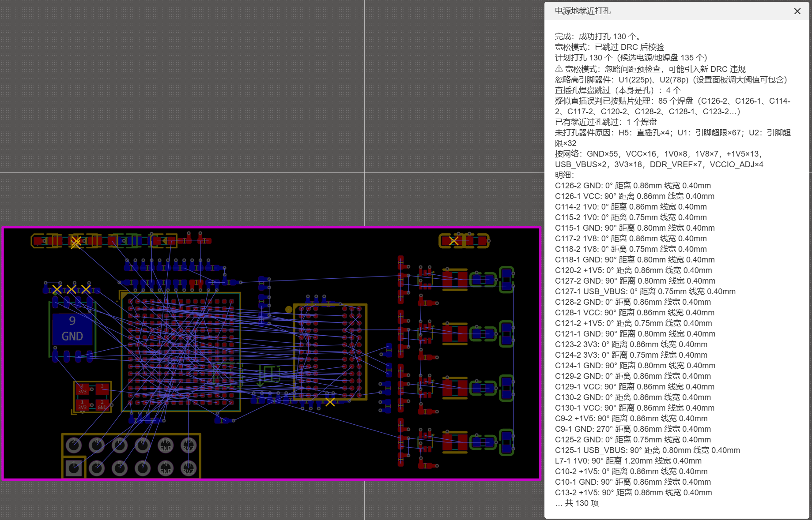
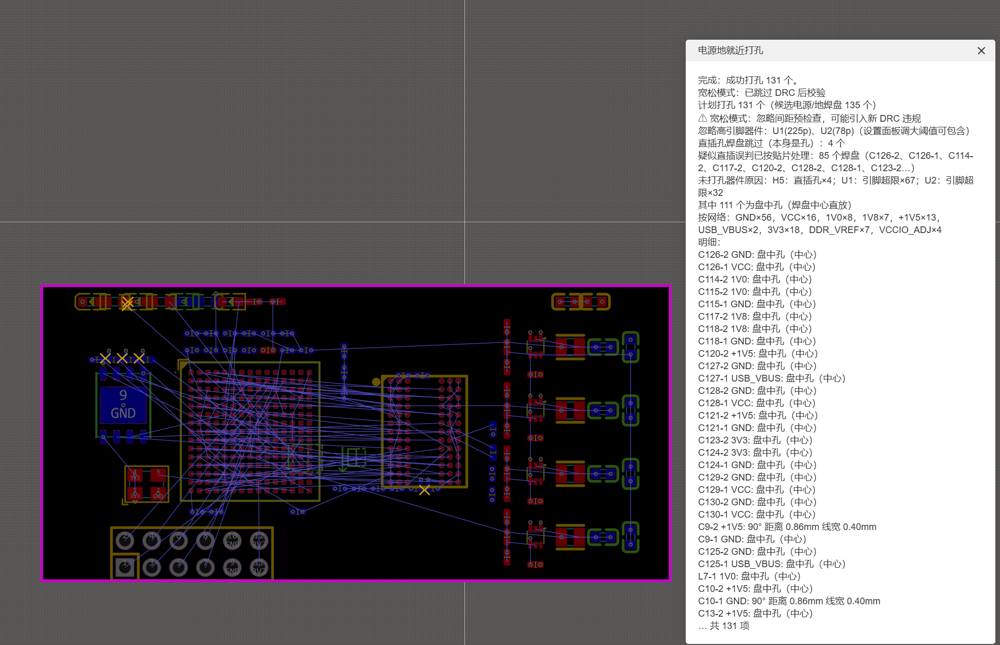
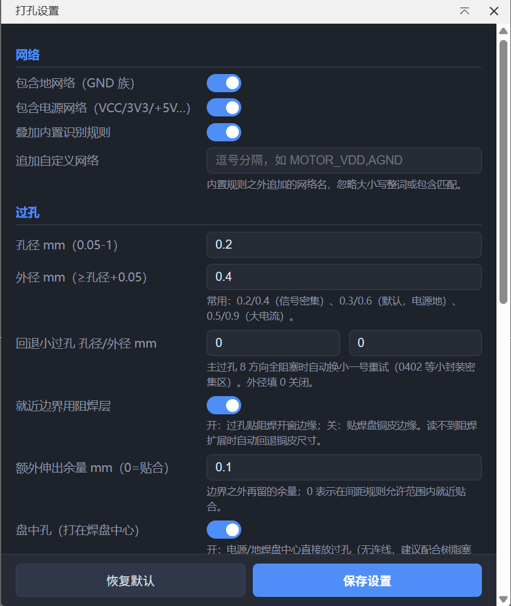
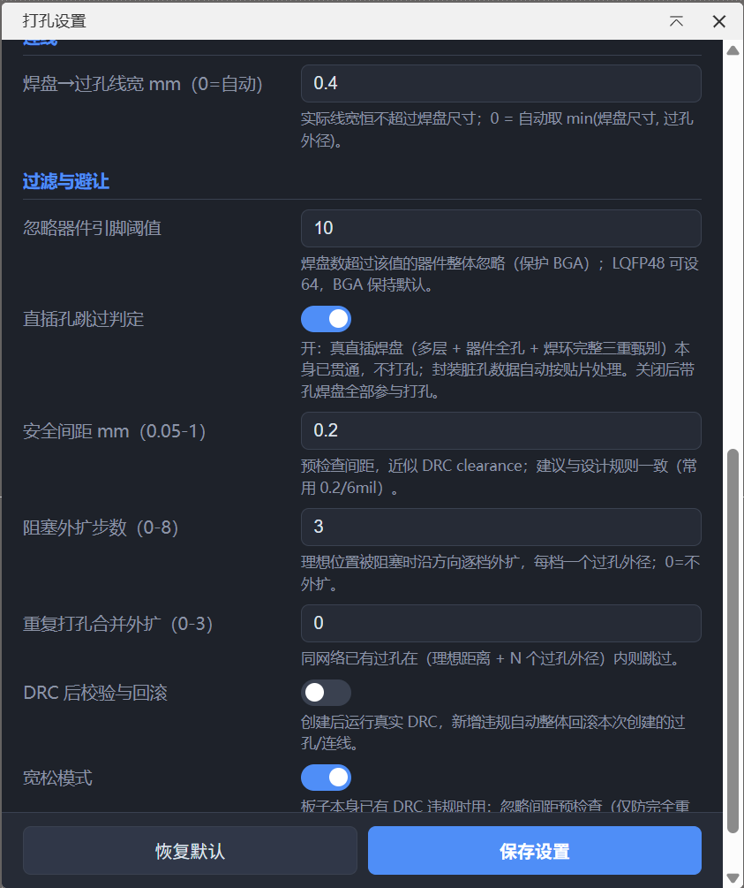

# LCEDA-pcb-autofanout 电源地就近打孔

嘉立创EDA专业版（EDA Pro / EasyEDA Pro）扩展：对**电压/GND 网络**的焊盘自动**就近扇出过孔**（打孔 + 焊盘到过孔连线，可选**盘中孔**：过孔直接打在焊盘中心），位置经过间距预检查与 DRC 后校验双保险。

## 功能演示

PCB 编辑器顶部菜单：


**就近模式**实战：135 个候选电源/地焊盘自动打出 130 个过孔，报告给出每个焊盘的打孔方向/距离/线宽、未打孔原因（直插甄别/引脚超限/合并去重）：



**盘中孔模式**：111 个过孔直接打在焊盘中心（无连线，报告会标注盘中孔数量）：



**图形设置面板**（网络/过孔/连线/过滤与避让四组参数，改动即自动保存）：





## 功能特性

- **网络自动识别**：内置 GND 词族（GND/AGND/PGND/GND1/GND_PLL…）与电压词族（VCC/VDD/VBUS/VBAT/3V3/+5V/1V8/3.3V/-5V…），可追加自定义网络名。
- **间距规则内就近打孔**：过孔边缘贴合焊盘边界——默认按**阻焊开窗边缘**判定（读取焊盘阻焊扩展，读不到回退焊盘铜皮尺寸），可选额外余量 stub（默认 0 = 贴合就近）。
- **盘中孔模式**（可选）：过孔直接打在**焊盘中心**，无需连线（建议配合树脂塞孔/电镀填孔工艺）；过孔整圆放不进焊盘或位置被占时自动回退就近打孔。
- **直线方向优先**：搜索顺序 0/90/180/270° 优先（长轴方向最先），45° 斜向仅作后备；0°/90° 被阻挡时走 180°/270° 而非斜向。
- **真直插跳过 + 脏孔自动甄别**：真直插焊盘（本身是通孔）自动跳过；判定须同时通过三重校验——**多层焊盘**（层=12/MULTI，SDK 定义焊盘层仅 1/2/12）、**器件全孔共识**（真直插件所有焊盘都带孔）、**焊环完整**（孔径+0.3mm ≤ 焊盘长边）。封装库残留的脏孔数据（如某批贴片电容单侧焊盘误带孔）自动按贴片处理照常打孔，并在报告列出「疑似直插误判已按贴片处理」清单。
- **位置自动判定（可通过 DRC）**：
  - 本地预检查：板边间距、异网络焊盘/过孔/走线间隙、同网络过孔合并去重、连线通道无冲突；
  - 阻塞时沿方向逐档外扩（每档一个过孔外径，可配置步数）；
  - 创建后调用 `eda.pcb_Drc.check` 复查，**新增违规自动整体回滚**。
- **连线宽度自适应**：焊盘→过孔线宽 = min(设定值, 焊盘尺寸)，**恒不超过焊盘大小**；设为 0 时自动取 min(焊盘尺寸, 过孔外径)。
- **BGA 保护**：焊盘数超过阈值（默认 32）的器件整体忽略，不参与打孔。
- **一键清理**：删除本插件历史创建的全部过孔/连线（不影响手工布线）。

## 使用

在 PCB 编辑器顶部菜单「电源地就近打孔」：

| 菜单 | 说明 |
| --- | --- |
| 一键打孔 | 提取 → 规划 → 写回 → DRC 后校验（可回滚） |
| 预览（不修改画布） | 只输出打孔计划明细（位置/方向/线宽） |
| 删除本插件创建的过孔/连线 | 按 ID 记录清理 |
| 设置面板... | 图形界面配置全部参数（改动即自动保存） |
| 关于 | 版本与当前配置摘要 |

### 默认参数

| 参数 | 默认值 | 说明 |
| --- | --- | --- |
| viaHoleMm / viaDiameterMm | 0.3 / 0.6 mm | 过孔孔径/外径 |
| fallbackViaHoleMm / fallbackViaDiameterMm | 0.2 / 0.4 mm | 回退小过孔：主过孔 8 方向全阻塞时自动换小一号重试（0402 密集区）；外径 0=关闭 |
| useSolderMask | 开 | 就近边界用阻焊开窗边缘（关=焊盘铜皮边缘） |
| viaInPad | 关 | 盘中孔：过孔直接打在焊盘中心（无连线，建议配合塞孔/填孔工艺）；放不下自动回退就近 |
| stubMm | 0 mm | 边界外额外余量（0 = 间距规则内贴合就近） |
| traceWidthMm | 0.4 mm | 连线宽度（0=自动；恒 ≤ 焊盘尺寸） |
| maxPins | 32 | 超过该引脚数的器件忽略（BGA 保护） |
| skipThiPads | 开 | 真直插焊盘跳过（多层+全孔+焊环三重甄别，脏孔自动按贴片）；关闭后带孔焊盘全部参与打孔 |
| clearanceMm | 0.15 mm | 预检查安全间距（6mil 标准工艺；最终由真实 DRC 兜底） |
| maxSearchSteps | 3 | 阻塞时沿方向外扩的最大档数 |
| mergeFactor | 1 | 同网络既有过孔在（理想距离 + N 个过孔外径）内则跳过 |
| useDrcCheck | 开 | 创建后真实 DRC 校验，新增违规自动回滚 |
| relaxedMode | 关 | 宽松模式：忽略间距预检查（仅防重叠）、跳过连线通道与 DRC 后校验；板子已有 DRC 违规时用，可能引入新违规 |

## 开发

```bash
npm install          # 或复制已有 SDK 工程的 node_modules
node test/run-offline.ts   # 离线测试（合成板 + 10.8 万项断言）
npm run lint
npm run build        # 产出 build/dist/lceda-pcb-autofanout_vX.Y.Z.eext
```
源码结构：

```
src/
├── index.ts        # 入口：菜单命令、设置面板（iframe）、报告
├── types.ts        # 数据模型 / 配置 / 默认值（单位 mil，配置 mm）
├── net-classify.ts # 电源/地网络识别（内置 + 自定义模式）
├── geometry.ts     # 几何：点-线段/矩形/胶囊体间隙、板内判定
├── planner.ts      # 核心算法（纯函数）：候选搜索 + 避让校验 → FanoutPlan
└── eda-adapter.ts  # EDA 读写：板状态提取 / applyPlan 写回 / DRC 回滚 / 配置存储
iframe/
└── settings.html   # 图形设置面板（eda.sys_Storage 注入直读写，与主线程共享配置）
test/
├── fixture.ts      # 合成板：0603/0402阵列/SOT-223/LQFP48/BGA256/真直插/脏孔各形态/混装/板角/底层/阻挡走线场景
├── run-offline.ts  # 断言 + 模拟写回（DRC 通过/失败回滚/单项失败）
├── verify-pkg.cjs  # .eext 包内容核验
└── debug-dump.ts   # 调试：打印每个焊盘的打孔/跳过原因
```

### 算法要点（参考 KiCad via-stitching 与常见 fanout 实践）

1. 候选距离 = 焊盘沿方向延伸半径（阻焊开窗或铜皮边缘）+ stub + 过孔半径，stub=0 时过孔边缘贴边界（间距规则内就近）；
2. 直线方向（0/90/180/270°）优先、长轴方向最先，45° 斜向仅作后备；先在全部方向尝试理想距离，再逐档外扩；
3. 直插（金属化孔）焊盘本身就是通孔，直接跳过——须通过多层(12)/器件全孔/焊环完整三重甄别，脏孔数据按贴片照常打孔；盘中孔模式时过孔直接取焊盘中心（外径 ≤ 焊盘短边且中心通过避让校验，否则回退就近搜索）；
4. 过孔对**所有铜层**障碍校验（通孔贯穿），连线只对**同层**异网络铜校验，同网络铜允许接触；
5. 新放入的过孔/连线立即成为后续焊盘的障碍（多焊盘器件不互相冲突）；
6. 真实 DRC 作为最终防线：前后违规数对比，新增即回滚。

### 已知限制

- 焊盘用轴对齐外接盒近似（旋转焊盘保守处理）；
- 铺铜不参与避让（铺铜区通常允许过孔打入）；
- 仅支持通孔（viaType=VIA），盲埋孔未支持；
- DRC 回滚为整体回滚（不做逐项定位）。

### 排查：为什么有些焊盘没打孔？

执行/预览报告会按器件列出未打孔原因，对照处理：

| 原因 | 处理 |
| --- | --- |
| 引脚超限（如 LQFP48 > 32） | 设置面板调大「忽略器件引脚阈值」（LQFP48 设 64；BGA 保持默认防误伤） |
| 直插孔 | 通过三重甄别（多层+全孔+焊环）的真直插，本身已贯通，属预期跳过；若怀疑误判看报告「疑似直插误判已按贴片处理」行与诊断明细（hole=孔径、layer=多层/顶/底），或临时关闭「直插孔跳过判定」 |
| 已有就近过孔 | 同网络过孔已在扇出邻域内，避免重复；可调小「合并外扩」 |
| 无有效位置 | 8 方向全部阻塞（0402 密集区最常见）：确认回退小过孔已开启；或增大「阻塞外扩步数」、减小过孔/安全间距，或先整理该区域布线 |

若整板几乎无候选焊盘，通常是网表未导入（焊盘无网络）——预览报告的"候选电源/地焊盘"计数为 0 即此情况；控制台（扩展日志）有提取汇总可进一步定位。

## License

Apache-2.0

## 开源 / Open Source

代码开源于 GitHub：`https://github.com/liuem/LCEDA-pcb-autofanout`

- CI：push / PR 自动执行 lint + 10.8 万项离线测试并构建 `.eext`；打 `v*` 标签自动发布 Release 并附安装包
- 面向使用者的完整文档见 [docs/使用说明.md](docs/使用说明.md)（嘉立创扩展商店页面同文）
- Bug / 建议请提 GitHub Issue，附「诊断」菜单控制台输出（`[autofanout]` 行）
